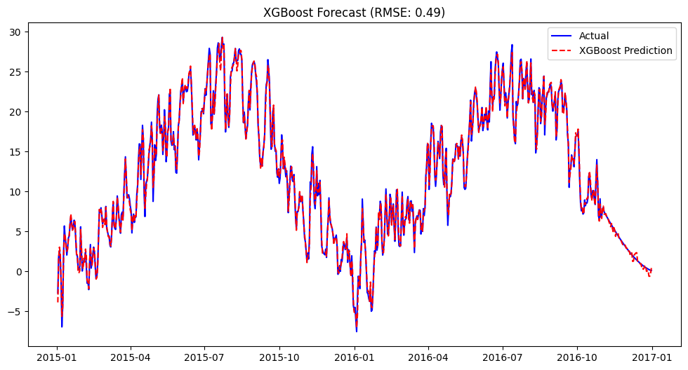

# Temp-Prediction
A comparative time-series analysis predicting daily temperature using Holt-Winters, Facebook Prophet, and XGBoost with Lag Features. Includes feature engineering and model evaluation.

# 🌤️ Comparative Analysis of Weather Forecasting Models

[](https://www.python.org/)
[](https://jupyter.org/)
[](https://www.kaggle.com/)

## 📌 Project Overview
The objective of this project is to accurately predict **Daily Temperature** based on historical weather data. This analysis compares the effectiveness of three different approaches in *Time Series Forecasting*:

1.  **Statistical Method:** Holt-Winters Exponential Smoothing (Triple Exponential Smoothing).
2.  **Automated Forecasting:** Facebook Prophet.
3.  **Machine Learning:** XGBoost Regressor (enhanced with *Custom Feature Engineering*).

The primary focus of this experiment is to demonstrate that a Machine Learning approach utilizing "memory" features (*Lag Features*) can outperform traditional statistical methods in capturing complex weather patterns.

## 📂 Dataset & Kaggle Code
The dataset used contains hourly weather data, including features such as temperature, humidity, wind speed, and pressure.

* **Dataset Source:** Weather Dataset.
* **Kaggle Link:** 👉 [Click here to view Dataset on Kaggle](https://www.kaggle.com/datasets/muthuj7/weather-dataset)

## 🛠️ Methodology

### 1. Data Preprocessing
* **Resampling:** Converted *hourly* data into *daily* averages to reduce noise and focus on macro trends.
* **Cleaning:** Handled missing values and performed UTC timezone conversion.
* **Feature Engineering (XGBoost):**
    * `Lag_1`, `Lag_2`, `Lag_7`: Added features representing the temperature from 1 day, 2 days, and 1 week prior to provide historical context.
    * `Rolling_Mean`: Added a 3-day moving average trend.

### 2. Models Used
* **Holt-Winters:** Selected for its ability to explicitly handle annual *Seasonality* and *Trend*.
* **Prophet:** Used as an automated baseline that is robust against *outliers* and missing data.
* **XGBoost:** A *Gradient Boosting* model tuned to learn non-linear patterns from the historical lag features.

## 📊 Results Comparison

Model evaluation was conducted using the **Root Mean Squared Error (RMSE)** metric. Below are the experimental results:

| Model | Type | RMSE (Celsius) | Performance Analysis |
| :--- | :--- | :--- | :--- |
| **Holt-Winters** | Statistical | **[6.1588]** | Captures annual seasonality well but is less responsive to daily fluctuations. |
| **Prophet** | Automated | **[3.4032]** | Stable, but tends to *underfit* during extreme weather changes. |
| **XGBoost** | Machine Learning | **[0.4864]** | **Best Performance**. Lag features significantly helped the model predict temperature based on the previous days' context. |

> *Note: A lower RMSE value indicates better prediction accuracy.*

## 📈 Visualizations
*(Best Model Performance: XGBoost with Lag Features)*



*The chart above illustrates the XGBoost prediction (Red) closely following the Actual trend (Blue) on the test data.*

## 🚀 How to Run
1.  Clone this repository:
    ```bash
    git clone [https://github.com/nicolausprima/weather-forecasting.git](https://github.com/nicolausprima/weather-forecasting.git)
    ```
2.  Install the required libraries:
    ```bash
    pip install pandas numpy matplotlib seaborn scikit-learn xgboost statsmodels prophet
    ```
3.  Run the notebook:
    ```bash
    jupyter notebook TempPrediction.ipynb
    ```

## 🤝 Conclusion
This experiment concludes that **XGBoost** combined with proper *Feature Engineering* (Lag & Rolling Window) yields the most accurate predictions compared to pure statistical methods. This highlights the importance of *contextual features* when applying Machine Learning to time-series data.

---
*Created by [Nicolaus Prima Dharma]*
